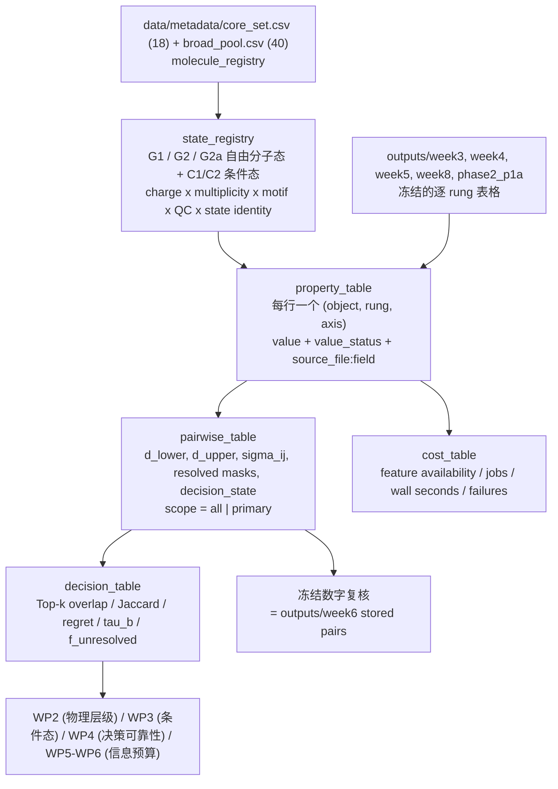

# Week 28 / WP1 样本流转图（sample flow）

> 由 `scripts/build_week28_evidence_table.py` 确定性生成。

## 1. 计算对象 -> 物理层级 -> 决策的流转

## 2. 各 rung 的实际候选覆盖（common set 大小）

| 对比 | 轴 | scope | 候选数 n | pair 数 |
| --- | --- | --- | --- | --- |
| P0_to_P1v | oxidation | all | 18 | 153 |
| P0_to_P1v | reduction | all | 18 | 153 |
| P1v_to_P1a | oxidation | all | 12 | 66 |
| P1v_to_P1a | reduction | all | 0 | — |
| P1v_to_P2a | oxidation | all | 18 | 153 |
| P1v_to_P2a | reduction | all | 18 | 153 |
| P1v_to_P2eps10 | oxidation | all | 12 | 66 |
| P1v_to_P2eps10 | reduction | all | 12 | 66 |
| P0_to_P2a | oxidation | all | 18 | 153 |
| P0_to_P2a | reduction | all | 18 | 153 |
| C0_to_C1 | oxidation | all | 10 | 45 |
| C0_to_C1 | oxidation | primary | 6 | 15 |
| C0_to_C1 | reduction | all | 10 | 45 |
| C0_to_C1 | reduction | primary | 1 | — |
| C1_to_C2 | oxidation | all | 10 | 45 |
| C1_to_C2 | oxidation | primary | 6 | 15 |
| C1_to_C2 | reduction | all | 10 | 45 |
| C1_to_C2 | reduction | primary | 1 | — |

## 3. 被规则挡掉的样本（必须写明，不能静默丢弃）

| 规则 | 挡掉的样本 | 原因 |
| --- | --- | --- |
| `unbound_anion` | P1a 还原轴 12 个对象 | 气相阴离子不是束缚态，绝热 EA 无物理意义（冻结 failure_rule） |
| R13 state-identity 闸门 | 还原轴 9 个 C1 对象 | Li-centered/mixed 还原不是分子还原，不得进入主 ranking |
| 数据缺失 | 见 `cost_table` 的 `n_missing` / `n_not_converged` | 仓库内确实没有数值，不强行补齐 |

